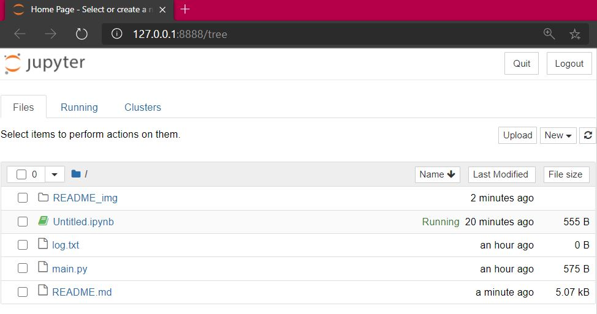
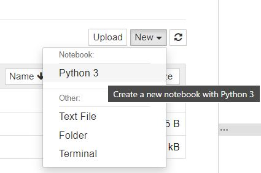
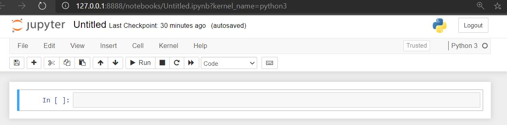
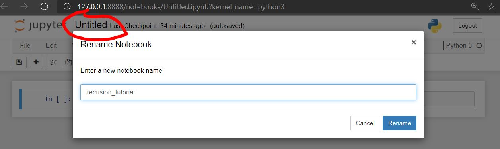
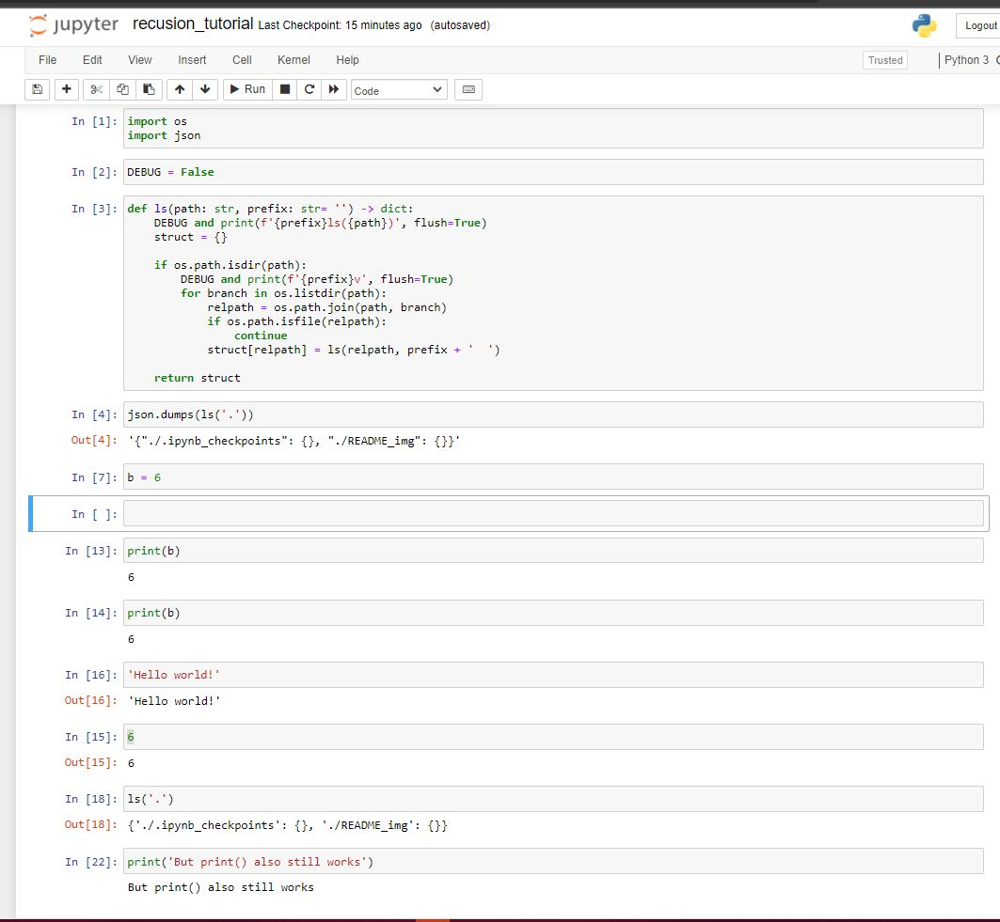
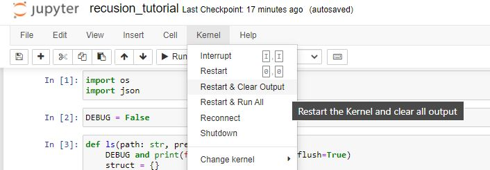

# Recursion in Python

### **Warning**:

Installing both conda and jupyter for the first time may consume more than 2GB of data.

### **Note**:

This guide is provided for educational purposes.

I believe it is absolutely crucial for developers to understand how their tools work "under the hood", so to speak.

Running jupyter lab with **docker** is lighter, faster, more convenient, and and more enjoyable.

## Step 0 - Conda

Src: https://docs.conda.io/projects/conda/en/latest/user-guide/install/macos.html

### Note:

I recommend installing the latest anaconda, but in this guide I will only describe installing miniconda.

Miniconda is a free minimal installer for conda. It is a small, bootstrap version of Anaconda that includes only conda, Python, the packages they depend on, and a small number of other useful packages, including pip, zlib and a few others.

Use the conda install command to install 720+ additional conda packages from the Anaconda repository.

Download page: https://docs.conda.io/en/latest/miniconda.html

### Step 0.1: Download MacOSX installer

```bash
$ wget https://repo.anaconda.com/miniconda/Miniconda3-latest-MacOSX-x86_64.sh
```

### Step 0.2: Check SHA256 Hash:

Hash: `9b9a353fadab6aa82ac0337c367c23ef842f97868dcbb2ff25ec3aa463afc871`

```bash
$ sha256sum Miniconda3-latest-MacOSX-x86_64.sh
```

(Visually compare the output of the command with the hash string provided.)

### Step 0.3: Install:

Execute the file with bash, and follow the prompts on the installer screens.

If you are unsure about any setting, accept the defaults. You can change them later.

```bash
bash Miniconda3-latest-MacOSX-x86_64.sh
```

To make the changes take effect, close and then re-open your terminal window.

### Step 0.4: Test conda:

In your terminal window or Anaconda Prompt, run the command `conda list`.

A list of installed packages appears if it has been installed correctly.

```bash
$ conda list
```

## Step 1 - Conda virtual environment

Cheat sheet: https://docs.conda.io/projects/conda/en/latest/_downloads/843d9e0198f2a193a3484886fa28163c/conda-cheatsheet.pdf

### Step 1.1: Create

Give your virtual environment a proper name.
Example env name for this project (Recursion in python): `ENVNAME="pycurse"`

```bash
$ ENVNAME="conda-env-name-for-my-project"
$ conda create --name $ENVNAME python=3.8 -y
```

### Step 1.2: Activate

```bash
$ conda activate $ENVNAME
```

### Step 1.3: Confirm environment is active:

Check if your terminal/command line has the name of the venv prefixed to each line, example:

```bash
(pycurse) $
```

## Step 2 - Jupyter Software

Whilst having your virtual environment activated, install the `jupyterlab` module from the `conda-forge` channel/repository

### Step 2.1: Install

Src:

- https://jupyter.org/install
- https://jupyterlab.readthedocs.io/en/latest/getting_started/installation.html

```bash
(pycurse) $ conda install -c conda-forge jupyterlab -y
```

### Step 2.2: Check

```bash
(pycurse) $ jupyter notebook --version
```

(Version **6.1.5**, at the time of writing)

## Step 3 - JupyterLab

#### **Note:**

I prefer running jupyter in the browser.

If you use VSCode, you can install the jupyter extension:
https://marketplace.visualstudio.com/items?itemName=ms-toolsai.jupyter

This allows you to run notebooks (cells) directly in VSCode, no server needed:
And although nice, I find running server+browser is more reliable.

### Step 3.1: Start the server

Run the following command to start the jupyter server.

Either:

```bash
(pycurse) $ jupyter lab
```

or:

```bash
(pycurse) $ jupyter notebook
```

Both work and do the same thing.

Expected outcome:

```
To access the notebook, open this file in a browser:
    file:///home/user/.local/share/jupyter/runtime/nbserver-3973-open.html
Or copy and paste one of these URLs:
    http://localhost:8888/?token=0a6f85869d45cb60123456fe7ca05d3b1633c0c726fce6e6
 or http://127.0.0.1:8888/?token=0a6f85869d45cb60123456fe7ca05d3b1633c0c726fce6e6
```

### Step 3.2: Connect with browser

You may access JupyterLab by entering the notebook server’s URL into the browser.

Simply `Ctrl+click` on the link from the previous step or copy and paste it into the browser.

The latest versions of the following browsers are currently known to work:

- Firefox
- Chrome
- Safari

JupyterLab uses CSS Variables for styling, which is one reason for the minimum versions listed above. IE 11+ or Edge 14 do not support CSS Variables, and are not directly supported at this time.

#### **Note:**

In my terminal, Ubuntu 20.04.1 LTS on WSL2 on Windows 10, I receive the following error from this command:

`Start : This command cannot be run due to the error: The system cannot find the file specified.`

This issue does not interfere with the normal operation of the notebook, and thus I am ignoring the error.

### Step 3.3: Create new notebook

You shuld now see the following interface (UI):



Click on the `New` dropdown, and select the `Python 3` option:



### Step 3.4: Rename notebook

The new notebook, currently named `Untitled.ipynb`, will open in a new tab:

(.ipynb is short for `Iron Python Notebook`)



Rename the notebook to something more appropriate. To rename, click on the text circled in red:



### Step 3.5: Run some code

Write some code.

I recommend you consider the following advice:

- Any valid python 3 (3.8) code will run.
- Dont put too much code in one cell.
- Every cell can be executed seperately.
- Cells can be executed repetetivly.
- No need to use the print function for simple stuff. Just execute the variable or function and the output will be printed below the cell.



### Step 3.6: Get comfortable and be productive

Professionals like you and me hates using the mouse while working, so to save those miliseconds, learn some keyboard shortcuts.
Here are some of the keyboard shortcuts I use (Thank me later):

- `Enter` simply adds a new line to the current cell at the cursor.
- `Shift+Enter` adds a new cell.
- `Ctrl+Enter` executes current cell.
- `Esc+s` saves current notebook.
- `Esc+d,d` delete cell.
- `Esc+z` Undo delete cell.

**Note:**
Although unusual, jupyter notebooks use `Esc` (Escape key) as a function key for most keyboard shortcuts.

Gratuitous example:

- To delete the current cell, hold down the escape (`Esc`) key, and simultaneously press the letter d (lowercase `D`) twice.
- To undo delete cells, hold down the escape (`Esc`) key, and simultaneously press the letter z (lowercase `Z`) once.
- To save, hold down the escape (`Esc`) key, and simultaneously press the letter s (lowercase `S`) once.

### Step 3.7: Reset kernel and clean output, then do it all again

After debugging, your server will be filled with state, and your webpage will be filled with text.
To clean up and basically refresh your notebook, do the following:

- At the top of the page, click on the menu item `Kernel`.
- Then click on the menu item `Restart kernel & Clear Output`.



There is no shortcut by default, so you will have to use the mouse every now and then. :(

## Step 4 - Have fun

Fin
